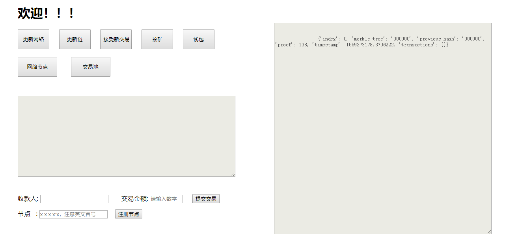
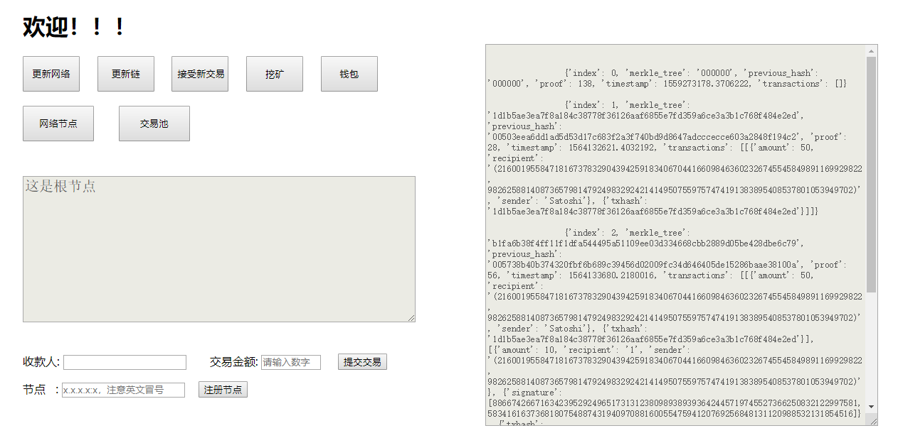

# SimBlockchain

python搭建入门区块链，了解比特币背后的原理，欢迎star！      

运行要求：    python 3.6+  

安装相关库：       

* hashlib库       `pip install hashlib`    

* requests库      `pip install requests`     

* Flsak库         `pip install Flask`  

# 运行  
  
解压文件，点击`app.py`运行，输入`127.0.0.1:5000`，这个端口是根节点的端口。  
  
运行新节点时，再次点击`app.py`运行,输入其他端口，如`127.0.0.1:5001`  

# 运行结果截图  
  
  
 
   
# 说明文档
[说明文档]https://www.jianshu.com/p/ccd7ae8b46c6
